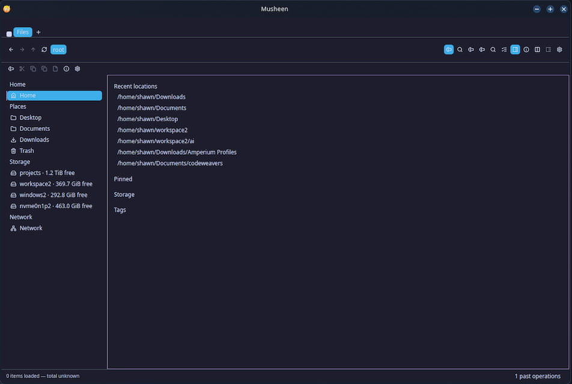

<p align="center">
  
</p>

<h1 align="center">Musheen</h1>

<p align="center">
  A file manager for Linux desktops, written in Rust with GPUI Kit.
</p>

<p align="center">
  
</p>

Musheen browses local and remote folders, runs file operations as a
queue you can pause and cancel, opens archives as folders, and edits
permissions, ACLs and ownership. It follows the desktop's theme and
works with the freedesktop services a Linux file manager should use:
UDisks2, the trash, `mimeapps.list`, Polkit, the Secret Service,
portals and the FileManager1 D-Bus interface.

Musheen is developed on KDE Plasma 6 and uses Dolphin as its model for
look and behaviour. It runs on Wayland and X11.

## Status

Musheen is pre-release software (version 0.1.0). The features below
work and have tests. Some screens still need visual polish, and there
are no distribution packages yet apart from an Arch Linux recipe.

The next planned work:

- File-type icons from your icon theme, with a bundled full-colour set
  as the fallback, and accent colours taken from the Plasma colour
  scheme.
- Image thumbnails in the file views, shared with the freedesktop
  thumbnail cache.
- Places read from `user-dirs.dirs` and the bookmarks that KDE and GTK
  share.
- Context menus drawn as native popups that can extend past the window,
  with fewer rows at the top level.
- Details columns you can resize and reorder by dragging, a path bar
  you can click to edit, and a progress dialog for long jobs.

The full specification is in [`docs/spec`](docs/spec), and the order
of the work is in [`docs/spec/roadmap.md`](docs/spec/roadmap.md).

## Features

### Browsing

- Tabs with session restore, reopen closed tab, and tear-out into a new
  window. One pane, or two side by side.
- Details, list, cards, grid, columns and adaptive views, with sort,
  group and folders-first options. The view is remembered per folder.
- A sidebar with Home, Places, pinned folders, mounted drives with
  their free space, network locations and tags.
- A path bar with breadcrumbs, path suggestions, and search and
  command modes.
- Recursive search, and filtering of the current folder.
- An info pane with text, code and image previews. Thumbnails are
  decoded in separate worker processes with limits on size, memory and
  time.

### File operations

- Copy, move, rename, batch rename, duplicate, symbolic and hard links,
  move to trash and permanent delete.
- Every operation is a queued job with progress, pause and cancel.
  Conflicts offer keep both, replace and skip, and merge for folders.
  Undo is offered when the inverse is still safe.
- Copies keep timestamps, permissions, ownership, extended attributes
  and ACLs where both locations support them. Writes go to a staging
  name first, so a cancelled or failed job never leaves a partial file
  under the final name.
- A job journal on disk, so work that a crash or restart interrupted is
  reported when Musheen starts again.

### Archives

- Browse ZIP, tar (plain, gzip and zstd) and 7z archives as folders,
  without extracting them.
- Extract to a chosen folder or next to the archive, and compress a
  selection. Encrypted ZIP and 7z archives ask for the password and
  never store it.
- With the `archive-libarchive` feature, RAR and ISO files open and
  extract through libarchive.
- Extraction refuses absolute paths, `..` paths and links that point
  outside the destination.

### Properties and permissions

- Properties for files, folders and multiple selections, with
  checksums (BLAKE3 and SHA-256).
- A Permissions page in the style of Dolphin, with an Advanced section
  that edits ACL entries.
- Owner and group changes that need administrator rights are applied
  as administrator after authorization.

### Remote locations

- SFTP (password, SSH agent, key file or stored key), FTP, FTPS,
  WebDAV and SMB, and NFS through kernel mounts.
- Passwords and keys are stored in the desktop's Secret Service
  keyring. They never appear in URLs, settings files or logs.

### Desktop integration

- Follows the system's light or dark mode and colour scheme through
  [native-theme](https://github.com/tiborgats/native-theme). You can
  override theme colours in Settings.
- Open With from the freedesktop `mimeapps.list` rules, with a separate
  Set as Default choice.
- Mount, unmount, eject and power off drives through UDisks2.
- Freedesktop trash with restore and empty.
- Implements the `org.freedesktop.FileManager1` D-Bus interface, so
  other applications can show a file or folder in Musheen.
- An optional FileChooser portal backend, so Musheen can serve as the
  desktop's file chooser.
- A terminal drawer inside the window, and Open Terminal Here for your
  own terminal.
- Runs programs and desktop entries according to an executable-file
  setting (open, ask or run), and runs scripts in a terminal on
  request.
- Open as Administrator (a separate window that browses as root) and
  Run as Administrator, through Polkit or sudo and a small broker
  program that checks each request.
- Notifications for background jobs that finish when no window is
  visible.

### Customization

- A Settings window with search.
- Editable toolbar and keyboard shortcuts, with collision checks.
- Custom actions for the context menu. They run without a shell.
- Tags, stored in extended attributes, with a fallback catalog for
  locations that do not support them.
- Translations: English and Arabic (right to left).
- Menus and dialogs expose their names, roles and states to assistive
  technology through AccessKit.

## Building from source

Musheen needs Rust 1.95. The file `rust-toolchain.toml` selects it
when you use rustup.

Install the build dependencies:

```sh
# Debian and Ubuntu
sudo apt install build-essential pkg-config libacl1-dev libarchive-dev \
    libfontconfig1-dev libfreetype6-dev libsmbclient-dev libxcb1-dev \
    libxkbcommon-dev libxkbcommon-x11-dev

# Arch Linux
sudo pacman -S --needed base-devel acl fontconfig freetype2 libarchive \
    libxcb libxkbcommon libxkbcommon-x11 smbclient
```

Build and run:

```sh
git clone https://github.com/eas4ai/musheen.git
cd musheen
cargo build --release --workspace --all-features --locked
./target/release/musheen
```

`--all-features` turns on RAR and ISO archives (`archive-libarchive`),
SMB (`smb-pavao`) and the FileChooser portal backend
(`portal-backend`). The first build compiles several hundred crates.
If your machine runs short of memory, lower the job count, for example
with `--jobs 2`.

At run time Musheen needs a GPU driver with Vulkan support. UDisks2,
Polkit, a Secret Service provider (such as KWallet or GNOME Keyring)
and `xdg-desktop-portal` are optional; without them the features that
use them are unavailable.

### Administrator actions

Open as Administrator, Run as Administrator and administrator
ownership changes use the broker program `musheen-broker`, which must
be installed at `/usr/lib/musheen/musheen-broker` together with its
Polkit policy. After a build, install both with:

```sh
sudo MUSHEEN_BROKER_BINARY=target/release/musheen-broker \
    packaging/install-polkit-policy.sh
```

The broker and the application check that they speak the same
protocol version. After you update Musheen, reinstall the broker too.

### Arch Linux package

[`packaging/arch`](packaging/arch) has a PKGBUILD and a script that
builds and tests the package in Docker. See its
[README](packaging/arch/README.md).

## Development

Before you send a change, run the same checks as CI:

```sh
cargo fmt --all --check
cargo clippy --workspace --all-targets --all-features --locked -- -D warnings
cargo test --workspace --all-features --locked
```

The tests need the same build dependencies as the application.

Each behaviour of Musheen is a numbered requirement in
[`docs/spec`](docs/spec), and each one states how a violation would be
seen. The checks for the requirements and the record of each
piece of work are kept with [Sudus](https://github.com/eas4ai/sudus)
in [`.sudus`](.sudus) and [`docs/decisions.jsonl`](docs/decisions.jsonl).

## License

Musheen is free software: you can redistribute it and/or modify it
under the terms of the GNU General Public License as published by the
Free Software Foundation, either version 3 of the License, or (at your
option) any later version. See [LICENSE](LICENSE) for the full text.

Musheen is distributed in the hope that it will be useful, but WITHOUT
ANY WARRANTY; without even the implied warranty of MERCHANTABILITY or
FITNESS FOR A PARTICULAR PURPOSE. See the GNU General Public License
for more details.

Copyright (C) 2026 Shawn McAllister ([@eas4ai](https://github.com/eas4ai)).

## Acknowledgements and third-party notices

Musheen is built on the work of many other projects. Their licences
are compatible with the GPL, and each one keeps its own licence.

### Vendored crates

Musheen builds these crates from patched copies under
[`vendor/`](vendor). [`docs/vendor.md`](docs/vendor.md) lists each
change and the reason for it. Each copy keeps its upstream licence
file.

| Crate | Project | Licence |
|---|---|---|
| `gpui-pre`, `gpui-pre-linux` | [GPUI](https://github.com/zed-industries/zed), the UI framework of the Zed editor, by Zed Industries | Apache-2.0 |
| `gpui-component` | [GPUI Kit](https://github.com/longbridge/gpui-kit) by Longbridge | Apache-2.0 |
| `native-theme-gpui` | [native-theme](https://github.com/tiborgats/native-theme) | MIT or Apache-2.0 or 0BSD |
| `sevenz-rust2` | [sevenz-rust2](https://github.com/hasenbanck/sevenz-rust) | Apache-2.0 |

### Bundled assets

- Interface icons from [Lucide](https://lucide.dev), embedded through
  GPUI Kit. ISC licence, Copyright (c) Lucide Icons and Contributors.
  The Lucide icons derived from [Feather](https://feathericons.com) are
  under the MIT licence, Copyright (c) 2013-present Cole Bemis.

### Libraries

Among the libraries Musheen uses:
[GPUI Kit](https://github.com/longbridge/gpui-kit) for the interface,
[native-theme](https://github.com/tiborgats/native-theme) for the
desktop theme,
[alacritty_terminal](https://github.com/alacritty/alacritty) for the
terminal drawer,
[Apache OpenDAL](https://opendal.apache.org) for FTP, SFTP and WebDAV,
[russh](https://github.com/Eugeny/russh) for SSH,
[pavao](https://github.com/veeso/pavao) and
[libsmbclient](https://www.samba.org) for SMB,
[libarchive](https://libarchive.org) through
[compress-tools](https://github.com/OSSystems/compress-tools-rs),
[zip](https://github.com/zip-rs/zip2),
[tar](https://github.com/alexcrichton/tar-rs),
[ashpd](https://github.com/bilelmoussaoui/ashpd) for portals,
[zbus](https://github.com/dbus2/zbus) for D-Bus,
[secret-service](https://github.com/hwchen/secret-service-rs) for the
keyring,
[notify](https://github.com/notify-rs/notify) for file watching,
[posix-acl](https://github.com/intgr/posix-acl) for ACLs,
[trash](https://github.com/Byron/trash-rs) for the freedesktop trash,
[image](https://github.com/image-rs/image) for thumbnails, and
[rustls](https://github.com/rustls/rustls) for TLS.

`Cargo.lock` lists every dependency. The licences in use include MIT,
Apache-2.0, BSD, ISC, Zlib, Unicode-3.0, MPL-2.0 and, for `acl-sys`,
LGPL-2.1. [`deny.toml`](deny.toml) lists the allowed licences for
`cargo deny check licenses`.

### Design references

- [Files](https://github.com/files-community/Files) (MIT) was the
  first reference for Musheen's feature set. Musheen does not use its
  code.
- [Dolphin](https://apps.kde.org/dolphin/) and
  [Nautilus](https://apps.gnome.org/Nautilus/) are the references for
  Linux behaviour, and Dolphin is the model for look and feel.
